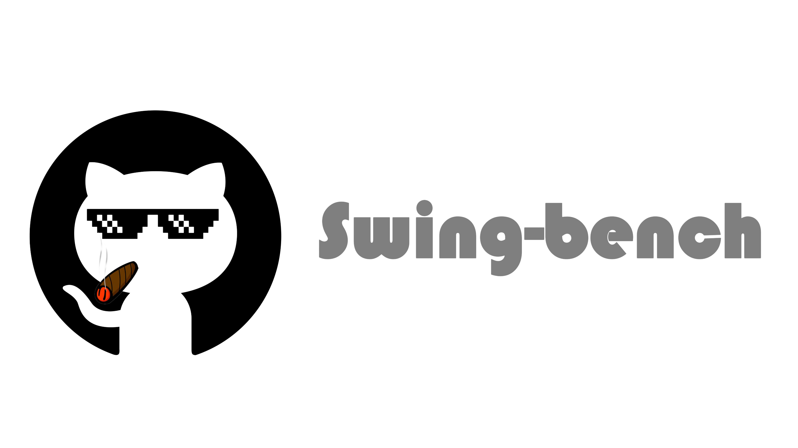
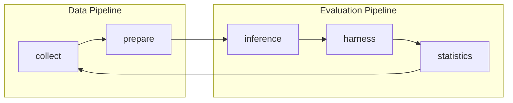

<p align="center">
  <a href="https://swebench.com">
    
  </a>
</p>

<div align="center">

 [English](https://github.com/menik1126/Swing-Bench/) 

</div>


<p align="center">
Code and data for our paper <a href="https://arxiv.org/abs/2505.23932">SwingArena: Competitive Programming Arena for Long-context GitHub Issue Solving</a>
    </br>
    </br>
    <a href="https://www.python.org/">
        
    </a>
    <a href="https://copyright.princeton.edu/policy">
        
    </a>
    <a href="https://badge.fury.io/py/swebench">
        
    </a>
</p>

Please refer our [website](https://swing-bench.github.io/) for the public leaderboard.

## 📰 News

* **[June. 5, 2024]**: We have released [SwingArena](https://arxiv.org/abs/2505.23932)! 

## 👋 Overview
SwingArena is a realistic, *CI-driven* evaluation framework for LLMs that simulates real-world software development by pairing models as patch *submitters* and *reviewers*, enhanced with *retrieval-augmented code generation* for multi-language support and long-context handling.


## 🛠️ Technical Architecture & Environment Setup

SwingArena employs an advanced containerized evaluation architecture that ensures cross-platform reproducibility and consistency. The system core relies on **Docker** for isolated environment management, combined with **CI tools** (such as GitHub Actions simulated through `act`) to achieve real-world software development workflow evaluation.

### 🏗️ Architecture & Module Overview

SwingArena consists of five core modules that work together to create a complete software engineering benchmark pipeline:

#### 📊 Module Workflow



#### 🔧 Core Modules

##### 📥 **collect** - Data Collection & Mining
- **Purpose**: Mine and filter high-quality GitHub repositories and pull requests
- **Key Functions**: Repository selection from top PyPI packages, PR collection with CI test validation, LLM-based quality filtering, expert rule-based validation
- **Outputs**: Task instances with issues, patches, and test cases

##### 🛠️ **prepare** - Data Preparation & Indexing  
- **Purpose**: Process and index collected data for efficient retrieval
- **Key Functions**: Repository cloning and management, BM25 search index construction, multi-stage quality filtering (CI, annotation, content), dataset validation and testing
- **Integration**: Builds indexes used by `inference` for context-aware generation

##### 🤖 **inference** - Model Inference Engine
- **Purpose**: Generate patches and solutions using various AI models
- **Key Functions**: API model support (OpenAI, Anthropic, Claude), local Llama model inference, live GitHub issue solving, retrieval-augmented code generation
- **Integration**: Uses prepared datasets and indexes from `prepare`

##### ⚔️ **harness** - Evaluation Framework
- **Purpose**: Evaluate model performance through CI-driven testing
- **Key Functions**: Dual-agent battle mode (patch submitter vs reviewer), CI workflow simulation, patch and test validation, Docker-based isolated execution
- **Integration**: Validates patches through real CI environments, similar to `collect` filtering

##### 📈 **statistics** - Analysis & Reporting
- **Purpose**: Analyze results and provide insights for dataset improvement
- **Key Functions**: Performance metric analysis, difficulty and clarity assessment, token usage and cost tracking, dataset quality reporting
- **Integration**: Provides feedback to improve `collect` filtering criteria (quality loop)

### 🔧 System Requirements
Before getting started, please ensure your system meets the following requirements:
- **Docker**: Follow the [Docker official installation guide](https://docs.docker.com/engine/install/) to install Docker Engine. Linux users are recommended to refer to the [post-installation steps](https://docs.docker.com/engine/install/linux-postinstall/) for optimal experience.
- **Hardware Configuration**: Recommended `x86_64` architecture machine with at least 120GB available storage, 16GB RAM, and 8 CPU cores (`arm64` support is still experimental)
- **Python Environment**: Python 3.8+ and related dependency packages

### 🏗️ Core Technology Stack
SwingArena integrates multiple cutting-edge technologies:

**AI Model Integration**: Supports various large language model APIs (OpenAI, Anthropic, Claude, etc.) and local model serving through a flexible model proxy system for seamless switching.

**Retrieval-Augmented Generation**: Built-in BM25 retriever provides precise relevant information retrieval for long-context code generation, supporting multi-language codebase indexing (Python, Rust, C++, Go, JavaScript, TypeScript, PHP, etc.).

**Distributed Evaluation**: Adopts multi-process parallel evaluation architecture with Modal cloud execution support, dynamically adjusting worker processes based on system resources (recommended not to exceed `min(0.75 * os.cpu_count(), 24)`).

**Arena Mechanism**: Pioneering dual-agent battle evaluation mode where one agent acts as a patch submitter and another as a code reviewer, simulating real collaborative development scenarios.

**Data Processing Pipeline**: Complete data collection, annotation, and evaluation pipeline with automated GitHub repository issue collection and PR analysis, multi-round annotation quality control, CI-driven validation, and detailed performance metrics analysis.

## 🚀 Quick Start

To build SwingArena from source, follow these steps:

### 🔧 Basic Installation
```bash
git clone https://github.com/menik1126/Swing-Bench.git
cd Swing-Bench
pip install -e .
```

### 🛠️ Full Installation with CI Tools (Recommended)
For complete SwingArena functionality including agent battles and CI simulation:
```bash
pip install -e ".[ci-tools]"
```

This enhanced installation will automatically:
- ✅ Install all Python dependencies 
- 🐳 **Install Docker** (on supported Linux distributions)
- 🔧 **Install `act`** (GitHub Actions local runner)
- 📦 Install Docker SDK for Python and YAML parser
- 🔗 Set up pre-commit hooks

> **💡 Note**: The basic `pip install -e .` only installs Python dependencies. For CI-driven evaluation and agent battles, the `[ci-tools]` installation is required.

### ☕ Java Requirements for BM25 Retrieval

If you plan to use BM25 retrieval for code search (used by the `prepare` and `inference` modules), you'll need Java 21+:

**Installation:**
```bash
# Using conda (recommended)
conda install openjdk=21

# Set environment variables (add to ~/.bashrc or ~/.zshrc)
export JVM_PATH=$CONDA_PREFIX/lib/jvm/lib/server/libjvm.so
export LD_LIBRARY_PATH=$CONDA_PREFIX/lib/jvm/lib/server:$LD_LIBRARY_PATH
```

**Alternative installation methods:**
- **Ubuntu/Debian**: `sudo apt-get install openjdk-21-jdk`
- **macOS**: `brew install openjdk@21`
- **Windows**: Download from [Adoptium](https://adoptium.net/) or use `choco install openjdk21`

> **💡 Note**: Java is required for the `pyserini` library used in BM25 indexing and retrieval. Without it, you can still use other SwingArena features but won't be able to build search indexes or use retrieval-augmented generation.

### 🔧 CI Tools Installation Details

**Prerequisites:**
- **Git** (required for repository operations)
- **Docker** (required for act to run GitHub Actions and containerized environments)
- **sudo/admin privileges** (for system-level tool installation)

**Alternative Installation Methods:**

If the automatic installation doesn't work, use the dedicated installer:
```bash
python install_ci_tools.py
```

**Manual Installation (if automatic fails):**

*Docker Installation:*
- **Linux (Ubuntu/Debian)**:
  ```bash
  curl -fsSL https://get.docker.com -o get-docker.sh
  sudo sh get-docker.sh
  sudo usermod -aG docker $USER
  ```
- **Linux (CentOS/RHEL)**:
  ```bash
  sudo yum install -y yum-utils
  sudo yum-config-manager --add-repo https://download.docker.com/linux/centos/docker-ce.repo
  sudo yum install -y docker-ce docker-ce-cli containerd.io
  sudo systemctl start docker && sudo systemctl enable docker
  sudo usermod -aG docker $USER
  ```
- **macOS**: [Download Docker Desktop](https://docs.docker.com/desktop/mac/install/) or `brew install --cask docker`
- **Windows**: [Download Docker Desktop](https://docs.docker.com/desktop/windows/install/) or use Chocolatey/winget

*act Installation:*
- **Linux**: `curl -s https://raw.githubusercontent.com/nektos/act/master/install.sh | sudo bash`
- **macOS**: `brew install act`
- **Windows**: `choco install act-cli` or `winget install nektos.act`

### ✅ Installation Verification

Test your basic installation:
```bash
python -m swingarena.harness.run_evaluation \
    --predictions_path gold \
    --max_workers 1 \
    --instance_ids sympy__sympy-20590 \
    --run_id validate-gold
```

Verify CI tools installation:
```bash
python install_ci_tools.py --check
```

Expected output after successful CI tools installation:
```
🔍 Checking CI tools installation status...

act (GitHub Actions): ✅ Installed
Docker: ✅ Installed  
Git: ✅ Installed
Python docker: ✅ Installed
Python yaml: ✅ Installed

📊 Overall status: ✅ All tools ready
```

### 🌩️ Cloud Evaluation with Modal
You can run evaluations entirely on the cloud using [Modal](https://modal.com/) to avoid local setup:
```bash
python -m swingarena.harness.run_evaluation \
    --predictions_path gold \
    --run_id validate-gold-modal \
    --instance_ids sympy__sympy-20590 \
    --modal true
```

> [!NOTE]
> Modal for SwingArena Multimodal is currently experimental and may not be fully supported yet.

### 🥊 Quick Start: Arena Battle Mode

SwingArena's unique dual-agent battle evaluation mode allows you to compare two AI models in a competitive programming environment.

**🔧 Setup Arena Environment:**

First, set up the required environment variables:
```bash
# Set your workspace directories
export SWING_TESTBED_PATH="/path/to/your/testbed"
export SWING_REPOS_DIR_PATH="/path/to/your/repos" 
export SWING_INDEXES_PATH="/path/to/your/indexes"
export CI_TOOL_NAME=act
```

**⚡ Quick Arena Battle:**

Run a simple battle between two models:
```bash
python swingarena/harness/agent_battle.py \
    --ci_tool_name act \
    --dataset_name SwingBench/SwingBench \
    --split Rust \
    --model_lhs "gpt-4" \
    --model_rhs "claude-3" \
    --api_key_lhs "your-api-key-1" \
    --api_key_rhs "your-api-key-2"
```

**📜 Using the Battle Script:**

For convenience, use the provided battle script:
```bash
# Configure environment variables in the script
./scripts/examples/battle_template.sh
```

**🎯 Arena Parameters:**
- `--model_lhs/rhs`: Left/Right side AI models (e.g., "gpt-4", "claude-3")
- `--api_key_lhs/rhs`: API keys for the respective models
- `--base_url_lhs/rhs`: Custom API endpoints (optional)
- `--split`: Dataset split (Rust, Python, Go, etc.)
- `--turns`: Number of battle turns (default: 1)
- `--ci_tool_name`: CI tool to use (default: "act")

> **⚠️ Prerequisites**: Ensure CI tools are installed with `pip install -e ".[ci-tools]"` or verify with `python install_ci_tools.py --check`

## 📊 Dataset Access

To access SwingArena datasets, copy and run the following code:
```python
from datasets import load_dataset
languages = ['rust', 'cpp', 'python', 'go', 'java', 'javascript', 'php']
swingbench = {}
for lang in languages:
    swingbench[lang] = load_dataset('SwingBench/SwingBench-data', split=lang)
```

## 🔄 Complete Workflow Example

Here's how to use the five core modules together:

### 1. **Data Collection** (`collect`)
Mine repositories and create task instances:
```bash
cd swingarena/collect
./run_get_tasks_pipeline.sh
```

### 2. **Data Preparation** (`prepare`)
Process and index datasets:
```bash
cd swingarena/prepare

# Clone repositories from task instances
python swing_clone_repos.py \
    --dataset_path /path/to/task-instances.jsonl \
    --repo_root_dir /path/to/repos

# Build BM25 search index
python swing_build_index.py \
    --dataset_path /path/to/task-instances.jsonl \
    --repo_root_dir /path/to/repos \
    --output_dir /path/to/indexes \
    --sub_dataset_identifier Python
```

### 3. **Model Inference** (`inference`)
Generate solutions with AI models:
```bash
cd swingarena/inference

# Using API models (OpenAI, Anthropic, etc.)
python -m swingarena.inference.run_api \
    --dataset_name_or_path /path/to/task-instances.jsonl \
    --split test \
    --model_name_or_path gpt-4 \
    --output_dir /path/to/output \
    --max_cost 1.0

# Or using local Llama models
python -m swingarena.inference.run_llama \
    --dataset_name_or_path /path/to/task-instances.jsonl \
    --model_name_or_path /path/to/llama-model \
    --output_dir /path/to/output
```

### 4. **Evaluation** (`harness`)
Test with CI-driven evaluation:
```bash
cd swingarena/harness  
python -m swingarena.harness.run_evaluation --predictions_path ./results
```

### 5. **Analysis** (`statistics`)
Generate insights and reports:
```bash
cd swingarena/statistics
python arena_stats.py --arena_log_dir ./evaluations
```

## 💽 Usage
> [!WARNING]
> Running fast evaluations on SWE-bench can be resource intensive
> We recommend running the evaluation harness on an `x86_64` machine with at least 120GB of free storage, 16GB of RAM, and 8 CPU cores.
> You may need to experiment with the `--max_workers` argument to find the optimal number of workers for your machine, but we recommend using fewer than `min(0.75 * os.cpu_count(), 24)`.
>
> If running with docker desktop, make sure to increase your virtual disk space to have ~120 free GB available, and set max_workers to be consistent with the above for the CPUs available to docker.
>
> Support for `arm64` machines is experimental.

Evaluate model predictions on SwingArena using the evaluation harness with the following command:
```bash
python -m swingarena.harness.run_evaluation \
    --dataset_name SwingBench/SwingBench \
    --predictions_path <path_to_predictions> \
    --max_workers <num_workers> \
    --run_id <run_id>
    # use --predictions_path 'gold' to verify the gold patches
    # use --run_id to name the evaluation run
```

This command will generate docker build logs (`logs/build_images`) and evaluation logs (`logs/run_evaluation`) in the current directory.

The final evaluation results will be stored in the `evaluation_results` directory.

To see the full list of arguments for the evaluation harness, run:
```bash
python -m swingarena.harness.run_evaluation --help
```

Additionally, the SwingArena repo can help you:
* Train your own models on our pre-processed datasets
* Run [inference](https://github.com/menik1126/Swing-Bench/blob/main/swingarena/inference/README.md) on existing models (either models you have on-disk like LLaMA, or models you have access to through an API like GPT-4). The inference step is where you get a repo and an issue and have the model try to generate a fix for it.
*  Run SwingArena's [data collection procedure](https://github.com/menik1126/Swing-Bench/blob/main/swingarena/collect/) on your own repositories, to make new SwingArena tasks.

## ⬇️ Downloads
| Datasets | Models |
| - | - |
| [🤗 SWE-bench](https://huggingface.co/datasets/princeton-nlp/SWE-bench) | [🦙 SWE-Llama 13b](https://huggingface.co/princeton-nlp/SWE-Llama-13b) |
| [🤗 "Oracle" Retrieval](https://huggingface.co/datasets/princeton-nlp/SWE-bench_oracle) | [🦙 SWE-Llama 13b (PEFT)](https://huggingface.co/princeton-nlp/SWE-Llama-13b-peft) |
| [🤗 BM25 Retrieval 13K](https://huggingface.co/datasets/princeton-nlp/SWE-bench_bm25_13K) | [🦙 SWE-Llama 7b](https://huggingface.co/princeton-nlp/SWE-Llama-7b) |
| [🤗 BM25 Retrieval 27K](https://huggingface.co/datasets/princeton-nlp/SWE-bench_bm25_27K) | [🦙 SWE-Llama 7b (PEFT)](https://huggingface.co/princeton-nlp/SWE-Llama-7b-peft) |
| [🤗 BM25 Retrieval 40K](https://huggingface.co/datasets/princeton-nlp/SWE-bench_bm25_40K) | |
| [🤗 BM25 Retrieval 50K (Llama tokens)](https://huggingface.co/datasets/princeton-nlp/SWE-bench_bm25_50k_llama)   | |

## 🍎 Tutorials
We've also written the following blog posts on how to use different parts of SWE-bench.
If you'd like to see a post about a particular topic, please let us know via an issue.
* [Nov 1. 2023] Collecting Evaluation Tasks for SwingArena ([🔗](https://github.com/menik1126/Swing-Bench/blob/main/swingarena/collect/README.md))
<!-- * [Nov 6. 2023] Evaluating on SWE-bench ([🔗](https://github.com/princeton-nlp/SWE-bench/blob/main/assets/evaluation.md)) -->


## 🚨 Troubleshooting

### Common CI Tool Issues

**1. "act: command not found"**
- Ensure `/usr/local/bin` is in your PATH
- Reinstall: `python install_ci_tools.py --force`

**2. "Docker daemon not running"**
- Start Docker service: `sudo systemctl start docker` (Linux)
- Start Docker Desktop (macOS/Windows)

**3. Permission denied errors**
- Add user to docker group: `sudo usermod -aG docker $USER`
- Log out and back in

For detailed troubleshooting, see [CI_TOOLS_SETUP.md](CI_TOOLS_SETUP.md).

## 💫 Contributions
We would love to hear from the broader NLP, Machine Learning, and Software Engineering research communities, and we welcome any contributions, pull requests, or issues!
To do so, please either file a new pull request or issue and fill in the corresponding templates accordingly. We'll be sure to follow up shortly!

Contact person: [Carlos E. Jimenez](http://www.carlosejimenez.com/) and [John Yang](https://john-b-yang.github.io/) (Email: carlosej@princeton.edu, johnby@stanford.edu).

## ✍️ Citation
If you find our work helpful, please use the following citations.
```
@article{xu2025swingarena,
  title={SwingArena: Competitive Programming Arena for Long-context GitHub Issue Solving},
  author={Xu, Wendong and Xiong, Jing and Zhao, Chenyang and Chen, Qiujiang and Wang, Haoran and Shen, Hui and Wan, Zhongwei and Dai, Jianbo and Wu, Taiqiang and Xiao, He and others},
  journal={arXiv preprint arXiv:2505.23932},
  year={2025}
}
```

## 🪪 License
MIT. Check `LICENSE.md`.